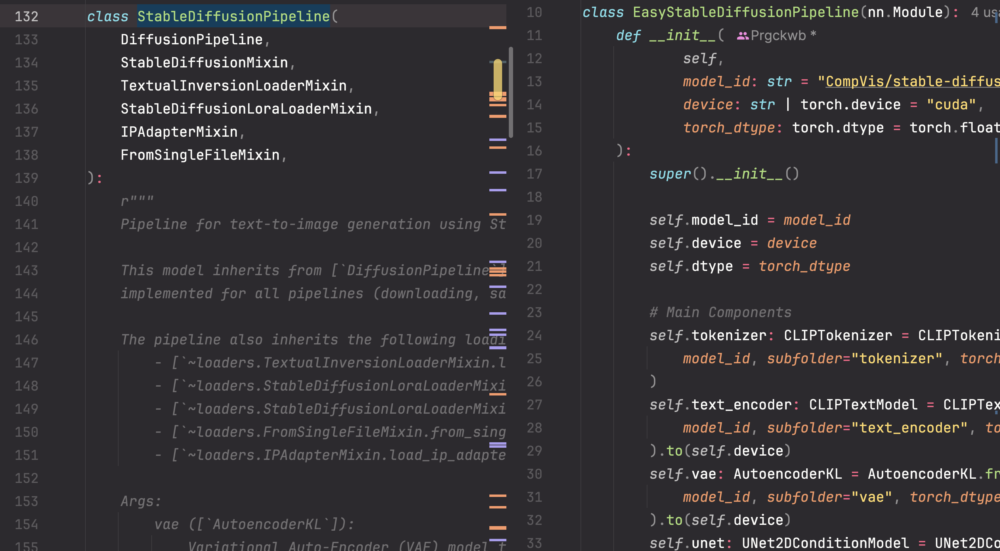

# easy-diffusers
Huggingface Diffusersライブラリの処理を簡単に理解するためのリポジトリです．

## これは何ですか？
Diffusers で Diffusion Model の学習をしたいと思い，コードを読んでみると複雑なコミュニティ実装に対応するためにパイプラインが複雑になっていることに気づくと思います．
このリポジトリでは、diffusersの元の実装をできるだけ壊さずに，重要な部分を抽出し、どのような処理が行われているのかを理解しやすくしています。

次のように，対応する diffusers のパイプラインに対して `EasyPipeline` が定義されています．


コード量の差は下の表のようになっています．

| クラス名                       | ファイルパス                                                                | 行数 |
|-------------------------------|------------------------------------------------------------------------|-----|
| StableDiffusionPipeline       | `diffusers/pipelines/stable_diffusion/pipeline_stable_diffusion.py`    | 1062 |
| EasyStableDiffusionPipeline   | `easy_diffusers/stable_diffusion/txt2img_stable_diffusion.py`          | 133  |

## 使用方法
### 1. diffusersパイプラインの基本的なプロセスを学ぶ
元の実装に比べて簡素化された形で書かれたパイプラインの処理を読むことで、その重要な側面を学ぶことができます。
コード内でフォーカスしている変数の形状を可能な限り記述することを心掛けています。

たとえば、StableDiffusionPipelineの画像生成プロセスでは、以下のようなコードを見ることができます：
```python
# ノイズ除去ループ
for i, t in enumerate(tqdm(timesteps)):
    latent_model_input = torch.cat([latents] * 2)  # (2, 4, 64, 64)
    latent_model_input = self.scheduler.scale_model_input(latent_model_input, t)  # (2, 4, 64, 64)

    # 残差ノイズの予測
    noise_pred = self.unet(latent_model_input, t, encoder_hidden_states=prompt_embed)[0]  # (2, 4, 64, 64)

    # 無条件および条件付きノイズ予測
    noise_pred_uncond, noise_pred_cond = noise_pred.chunk(2)
    noise_pred = guidance_scale * noise_pred_cond + (1 - guidance_scale) * noise_pred_uncond

    # 潜在変数の更新 x_t -> x_t-1
    latents = self.scheduler.step(noise_pred, t, latents)[0]

# 潜在変数を画像にデコード
image = self.vae.decode(latents // 0.18215, return_dict=False, generator=generator)[0]  # (1, 3, 512, 512)
image = self.image_processor.postprocess(image, output_type='pil')

return image
```

詳細なオプションによる条件分岐を可能な限り減らしているため、何がされているか理解しやすいです。

### 2. 簡素化されたコードをリファレンスとして使用する
簡素化されたパイプラインを元の実装と同様に利用することもできます。
```python
from easy_diffusers import EasyStableDiffusionPipeline

model = EasyStableDiffusionPipeline()
prompt = 'a photo of a dog'
image = model(prompt)
image.save('output/sample.png')
```

## 引用
このリポジトリを利用する際は、次のように元のリポジトリを引用してください：
```bibtex
@misc{von-platen-etal-2022-diffusers,
  author = {Patrick von Platen and Suraj Patil and Anton Lozhkov and Pedro Cuenca and Nathan Lambert and Kashif Rasul and Mishig Davaadorj and Thomas Wolf},
  title = {Diffusers: State-of-the-art diffusion models},
  year = {2022},
  publisher = {GitHub},
  journal = {GitHub repository},
  howpublished = {\url{https://github.com/huggingface/diffusers}}
}
```