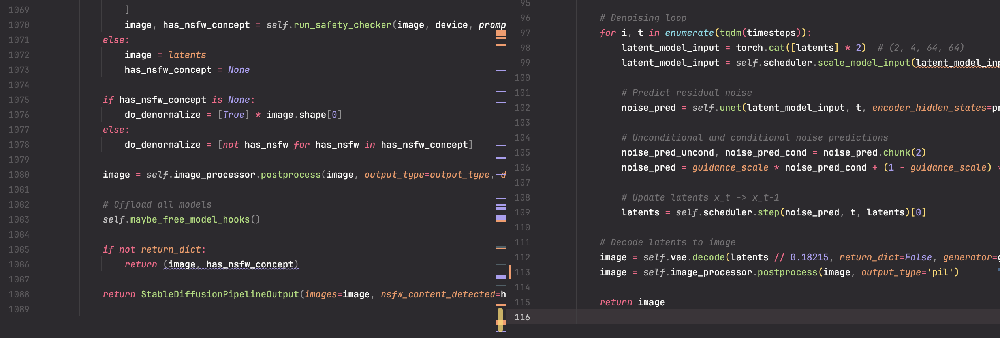

# easy-diffusers
A repository with a brief description of the Huggingface Diffusers library and its simpler flow.

## What is this?
In this repository, I make it easier to understand what kind of processing is being done by extracting important parts without breaking the original implementation of diffusers as much as possible.

For example, there is a difference in the amount of code like this:


## Usage
### 1. Learn the essential processes of diffusers pipelines
By reading the processing of the pipeline written in a simplified manner compared to the original implementation, you can learn its important aspects. We try to note the shapes of the variables we are focusing on as much as possible within the code.

For instance, in the image generation process of the StableDiffusionPipeline, you can see code like the following:
```python
# Denoising loop
for i, t in enumerate(tqdm(timesteps)):
    latent_model_input = torch.cat([latents] * 2)  # (2, 4, 64, 64)
    latent_model_input = self.scheduler.scale_model_input(latent_model_input, t)  # (2, 4, 64, 64)

    # Predict residual noise
    noise_pred = self.unet(latent_model_input, t, encoder_hidden_states=prompt_embed)[0]  # (2, 4, 64, 64)

    # Unconditional and conditional noise predictions
    noise_pred_uncond, noise_pred_cond = noise_pred.chunk(2)
    noise_pred = guidance_scale * noise_pred_cond + (1 - guidance_scale) * noise_pred_uncond

    # Update latents x_t -> x_t-1
    latents = self.scheduler.step(noise_pred, t, latents)[0]

# Decode latents to image
image = self.vae.decode(latents // 0.18215, return_dict=False, generator=generator)[0]  # (1, 3, 512, 512)
image = self.image_processor.postprocess(image, output_type='pil')

return image
```

I have reduced the conditional branching due to detailed options as much as possible, so it should be easy to understand what is being done.

### 2. Use the simplified code as a reference
You can also use the simplified pipeline in the same way as the original implementation.
```python
from easy_diffusers import SimpleStableDiffusionPipeline

model = SimpleStableDiffusionPipeline()
prompt = 'a photo of a dog'
image = model(prompt)
image.save('output/sample.png')
```

## Citation
If you use this repository, please cite the original repository as follows:
```bibtex
@misc{von-platen-etal-2022-diffusers,
  author = {Patrick von Platen and Suraj Patil and Anton Lozhkov and Pedro Cuenca and Nathan Lambert and Kashif Rasul and Mishig Davaadorj and Thomas Wolf},
  title = {Diffusers: State-of-the-art diffusion models},
  year = {2022},
  publisher = {GitHub},
  journal = {GitHub repository},
  howpublished = {\url{https://github.com/huggingface/diffusers}}
}
```